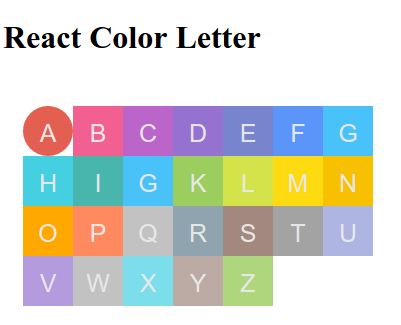

react-color-letter
===
彩色背景字母




```js
git clone git@github.com:react-li/react-color-letter.git
npm install
npm start
```
在浏览器中打开 http://localhost:3031 即可查看例子


## demo

```
import React from 'react';
import ReactDOM from 'react-dom';
import ColorLetter from 'react-color-letter';

class App extends React.Component {

  render() {
    return (
      <div style={{marginLeft: '20px'}}>
        <ColorLetter name='a' size={50} radius={50}/>
        <ColorLetter name='b'/>
        <ColorLetter name='c' />
        <ColorLetter name='d' />
        <ColorLetter name='e' />
        <ColorLetter name='f' />
        <ColorLetter name='g' />
        <ColorLetter name='h' />
        <ColorLetter name='iii' />
        <ColorLetter name='gg' />
        <ColorLetter name='k' />
        <ColorLetter name='l' />
        <ColorLetter name='mg' />
        <ColorLetter name='ng' />
        <ColorLetter name='og' />
        <ColorLetter name='pg' />
        <ColorLetter name='qg' />
        <ColorLetter name='Rg' />
        <ColorLetter name='sg' />
        <ColorLetter name='tg' />
        <ColorLetter name='ug' />
        <ColorLetter name='vg' />
        <ColorLetter name='wg' />
        <ColorLetter name='xg' />
        <ColorLetter name='Yg' />
        <ColorLetter name='zg' />
      </div>
    );
  }
}

ReactDOM.render(<App />, document.getElementById('app'));
```


# 使用
`npm install react-color-letter --save`


```js
import ColorLetter from 'react-color-letter'


<ColorLetter 
  name="A"
  size={50}
  radius={50}
/>
```

# License

 MIT


